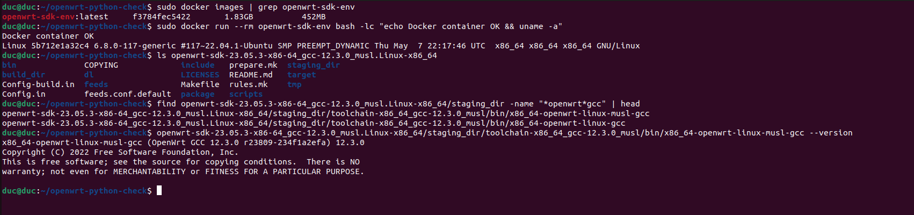
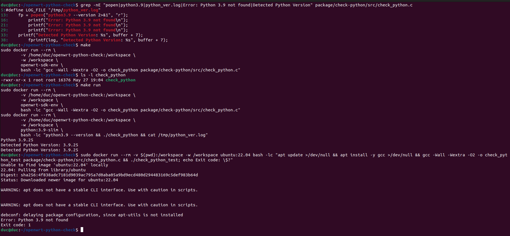
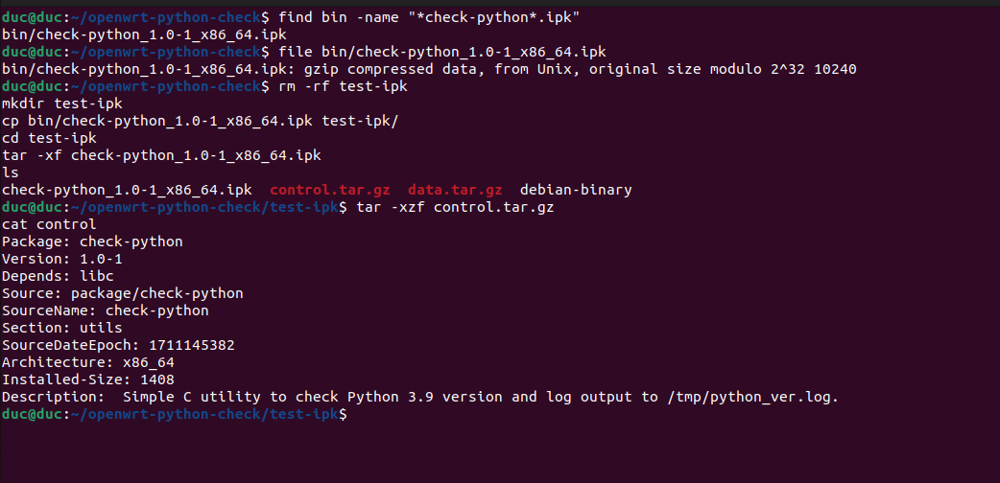
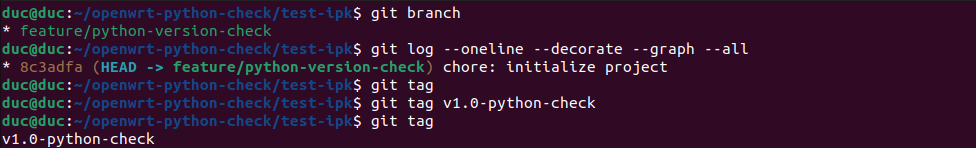
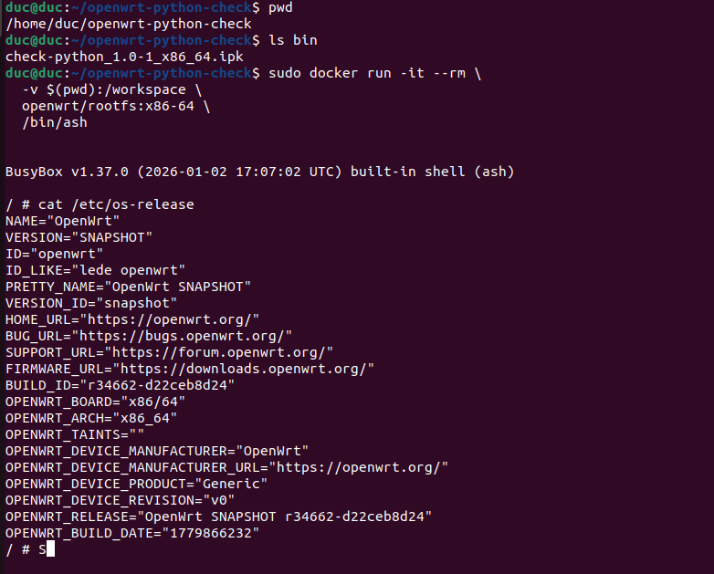
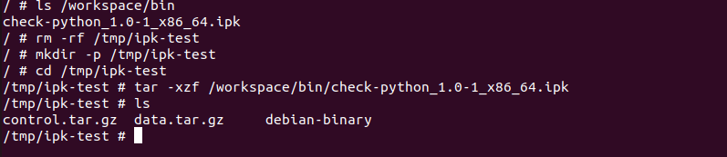
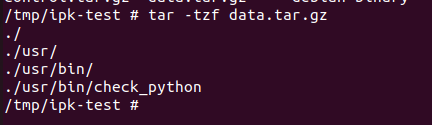
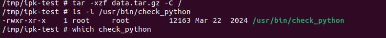
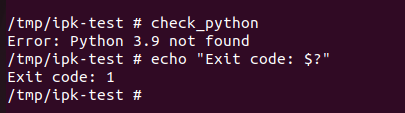
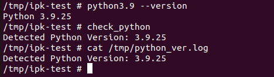

# Mock Project: Hiển thị phiên bản Python 3.9 bằng ứng dụng C tích hợp trong OpenWrt

## 1. Tổng quan dự án

Đây là một project mô phỏng quy trình phát triển ứng dụng userspace cho hệ thống nhúng chạy OpenWrt.

Mục tiêu chính của project là viết một chương trình C đơn giản có nhiệm vụ kiểm tra phiên bản Python 3.9 đã được cài đặt trong hệ thống. Chương trình sẽ gọi lệnh hệ thống:

```bash
python3.9 --version
```

Sau đó chương trình sẽ:

- In phiên bản Python ra terminal.
- Ghi kết quả vào file log `/tmp/python_ver.log`.
- Báo lỗi nếu không tìm thấy Python 3.9.

Project này sử dụng Docker để tạo môi trường build độc lập. Bên trong Docker container, OpenWrt SDK được sử dụng để biên dịch và đóng gói chương trình C thành package `.ipk`.

Quy trình tổng quát:

```text
Máy host Linux
        ↓
Docker container
        ↓
OpenWrt SDK / OpenWrt toolchain
        ↓
Ứng dụng C
        ↓
Package OpenWrt .ipk
```

Đề bài mô tả hệ thống OpenWrt chạy trên Raspberry Pi 4B. Trong quá trình thực hiện project này, em sử dụng OpenWrt SDK target `x86/64` để mô phỏng, build và kiểm tra package trên môi trường local. Nếu muốn build đúng cho Raspberry Pi 4B, chỉ cần thay SDK target sang `bcm27xx/bcm2711`.

---

## 2. Mục tiêu bài tập

Project được thực hiện nhằm luyện tập các kỹ năng sau:

- Sử dụng Docker để tạo môi trường build độc lập.
- Sử dụng Git để quản lý phiên bản, branch, commit và tag.
- Sử dụng Makefile để tự động hóa các bước build, run, clean và package.
- Viết ứng dụng C chạy trong môi trường Linux/OpenWrt.
- Sử dụng OpenWrt SDK để biên dịch ứng dụng.
- Đóng gói ứng dụng userspace thành file `.ipk`.
- Kiểm tra nội dung package `.ipk` sau khi build.

---

## 3. Chức năng chính của chương trình

Chương trình C thực hiện các chức năng sau:

- Gọi lệnh:

```bash
python3.9 --version
```

- Kiểm tra Python 3.9 có tồn tại hay không.
- Nếu tồn tại, in ra terminal:

```text
Detected Python Version: 3.9.x
```

- Ghi kết quả vào file:

```text
/tmp/python_ver.log
```

- Nếu không tìm thấy Python 3.9, in ra:

```text
Error: Python 3.9 not found
```

- Thoát chương trình với mã lỗi khác 0 nếu Python 3.9 không tồn tại.

---

## 4. Cấu trúc project

Cấu trúc project sau khi hoàn thành:

```text
openwrt-python-check/
├── Dockerfile
├── Makefile
├── README.md
├── .gitignore
├── bin/
│   └── check-python_1.0-1_x86_64.ipk
├── package/
│   └── check-python/
│       ├── Makefile
│       └── src/
│           └── check_python.c
└── test-ipk/
```

Ý nghĩa các file và thư mục chính:

| Thành phần | Ý nghĩa |
|---|---|
| `Dockerfile` | Tạo môi trường Docker để build project |
| `Makefile` | Tự động hóa các lệnh build, run, clean, package |
| `README.md` | Tài liệu mô tả project |
| `.gitignore` | Loại bỏ SDK, file tạm và thư mục không cần commit |
| `package/check-python/src/check_python.c` | Mã nguồn chương trình C |
| `package/check-python/Makefile` | Makefile package theo chuẩn OpenWrt |
| `bin/check-python_1.0-1_x86_64.ipk` | File package OpenWrt sau khi build |

---

## 5. Môi trường sử dụng

Project được thực hiện trên máy Linux.

Các công cụ sử dụng:

- Docker
- Git
- Make
- GCC
- OpenWrt SDK 23.05.3
- Ngôn ngữ C
- OpenWrt package build system

Docker image sử dụng:

```text
openwrt-sdk-env
```

OpenWrt SDK sử dụng trong project:

```text
openwrt-sdk-23.05.3-x86-64_gcc-12.3.0_musl.Linux-x86_64
```

Target build hiện tại:

```text
x86_64
```

File package sinh ra:

```text
check-python_1.0-1_x86_64.ipk
```

---

## 6. Các bước thực hiện chi tiết

### Bước 1: Tạo thư mục project

```bash
mkdir openwrt-python-check
cd openwrt-python-check
```

---

### Bước 2: Khởi tạo Git và tạo branch

```bash
git init
git checkout -b feature/python-version-check
```

Branch sử dụng trong project:

```text
feature/python-version-check
```

Branch này đáp ứng yêu cầu Git Integration của bài tập.

---

### Bước 3: Tạo Dockerfile

File `Dockerfile` được tạo để xây dựng môi trường build độc lập.

Dockerfile cài đặt các công cụ cần thiết như:

- `build-essential`
- `gcc`
- `g++`
- `make`
- `git`
- `wget`
- `rsync`
- `python3`
- `python3-distutils`
- `python3-setuptools`
- `libncurses5-dev`
- `zlib1g-dev`

Các gói này cần thiết để sử dụng OpenWrt SDK và build package `.ipk`.

Build Docker image:

```bash
sudo docker build -t openwrt-sdk-env .
```

Kiểm tra Docker image:

```bash
sudo docker images | grep openwrt-sdk-env
```

Kết quả mong muốn:

```text
openwrt-sdk-env
```

---

### Bước 4: Chạy Docker container

Chạy container và mount thư mục project vào `/workspace`:

```bash
sudo docker run -it --rm -v $(pwd):/workspace openwrt-sdk-env
```

Sau khi vào container, thư mục làm việc là:

```text
/workspace
```

Việc mount thư mục giúp các file được tạo bên trong container vẫn xuất hiện trên máy host.

---

### Bước 5: Tải OpenWrt SDK

Bên trong Docker container, tải OpenWrt SDK target `x86/64`:

```bash
wget https://downloads.openwrt.org/releases/23.05.3/targets/x86/64/openwrt-sdk-23.05.3-x86-64_gcc-12.3.0_musl.Linux-x86_64.tar.xz
```

Giải nén SDK:

```bash
tar -xf openwrt-sdk-23.05.3-x86-64_gcc-12.3.0_musl.Linux-x86_64.tar.xz
```

Vào thư mục SDK:

```bash
cd openwrt-sdk-23.05.3-x86-64_gcc-12.3.0_musl.Linux-x86_64
```

---

### Bước 6: Tạo package OpenWrt

Bên trong thư mục OpenWrt SDK, tạo thư mục package:

```bash
mkdir -p package/check-python/src
```

Cấu trúc package:

```text
package/check-python/
├── Makefile
└── src/
    └── check_python.c
```

---

### Bước 7: Viết chương trình C

File chương trình chính:

```text
package/check-python/src/check_python.c
```

Chương trình sử dụng hàm `popen()` để gọi lệnh:

```bash
python3.9 --version
```

Một số đoạn quan trọng trong chương trình:

```c
fp = popen("python3.9 --version 2>&1", "r");
```

Dòng này dùng để chạy lệnh kiểm tra phiên bản Python 3.9.

```c
printf("Detected Python Version: %s", buffer + 7);
```

Dòng này dùng để in phiên bản Python ra terminal.

```c
fprintf(log, "Detected Python Version: %s", buffer + 7);
```

Dòng này dùng để ghi kết quả vào file log.

File log được lưu tại:

```text
/tmp/python_ver.log
```

Nếu Python 3.9 không tồn tại, chương trình in:

```text
Error: Python 3.9 not found
```

---

### Bước 8: Tạo OpenWrt package Makefile

File Makefile của package nằm tại:

```text
package/check-python/Makefile
```

Makefile này định nghĩa:

- Tên package
- Phiên bản package
- Thư mục build
- Cách compile chương trình C
- Cách install binary vào rootfs OpenWrt

Thông tin package:

```makefile
PKG_NAME:=check-python
PKG_VERSION:=1.0
PKG_RELEASE:=1
```

Binary sau khi cài sẽ nằm tại:

```text
/usr/bin/check_python
```

Luồng cài đặt trong OpenWrt Makefile:

```makefile
define Package/check-python/install
	$(INSTALL_DIR) $(1)/usr/bin
	$(INSTALL_BIN) $(PKG_BUILD_DIR)/check_python $(1)/usr/bin/check_python
endef
```

Dòng này có nghĩa là file binary `check_python` sẽ được copy vào thư mục `/usr/bin` của hệ thống OpenWrt.

---

### Bước 9: Build package bằng OpenWrt SDK

Bên trong thư mục OpenWrt SDK, chạy:

```bash
make defconfig
```

Sau đó build package:

```bash
make package/check-python/compile V=s
```

Nếu build thành công, file `.ipk` sẽ được sinh ra tại:

```text
bin/packages/x86_64/base/check-python_1.0-1_x86_64.ipk
```

Copy file `.ipk` ra thư mục `bin/` của project:

```bash
mkdir -p /workspace/bin
cp bin/packages/x86_64/base/check-python_1.0-1_x86_64.ipk /workspace/bin/
```

File kết quả:

```text
bin/check-python_1.0-1_x86_64.ipk
```

---

## 7. Makefile tự động hóa

Project có một Makefile ở thư mục gốc để tự động hóa các bước chính.

Các target hỗ trợ:

| Lệnh | Chức năng |
|---|---|
| `make` | Biên dịch chương trình C |
| `make run` | Chạy chương trình trong Docker container |
| `make package` | Build package OpenWrt `.ipk` |
| `make clean` | Xóa file build tạm |
| `make shell` | Mở shell tương tác trong Docker container |

---

### Biên dịch chương trình C

```bash
make
```

Kiểm tra file binary:

```bash
ls -l check_python
```

Kết quả mong muốn:

```text
check_python
```

---

### Chạy chương trình trong Docker

```bash
make run
```

Kết quả mong muốn:

```text
Python 3.9.x
Detected Python Version: 3.9.x
Detected Python Version: 3.9.x
```

Ý nghĩa:

- Dòng đầu tiên xác nhận container test có Python 3.9.
- Dòng thứ hai là kết quả do chương trình C in ra terminal.
- Dòng thứ ba là nội dung được đọc lại từ file `/tmp/python_ver.log`.

---

### Build package OpenWrt

```bash
make package
```

Kiểm tra file `.ipk`:

```bash
find bin -name "*check-python*.ipk"
```

Kết quả mong muốn:

```text
bin/check-python_1.0-1_x86_64.ipk
```

---

### Dọn file build

```bash
make clean
```

Lệnh này xóa các file build tạm như:

```text
check_python
test-ipk/
check-ipk/
```

---

## 8. Kiểm tra chương trình C

Để kiểm tra chương trình C có đủ yêu cầu đề bài hay không, dùng lệnh:

```bash
grep -nE "popen|python3.9|python_ver.log|Error: Python 3.9 not found|Detected Python Version" package/check-python/src/check_python.c
```

Kết quả cần có các nội dung:

```text
popen("python3.9 --version 2>&1", "r")
/tmp/python_ver.log
Detected Python Version
Error: Python 3.9 not found
```

Điều này chứng minh chương trình đã:

- Gọi lệnh `python3.9 --version`.
- Ghi log vào `/tmp/python_ver.log`.
- In kết quả phiên bản Python.
- Xử lý lỗi khi không tìm thấy Python 3.9.

---

## 9. Kiểm tra package `.ipk`

Kiểm tra file `.ipk` đã được tạo:

```bash
find bin -name "*check-python*.ipk"
```

Kết quả mong muốn:

```text
bin/check-python_1.0-1_x86_64.ipk
```

Kiểm tra định dạng file:

```bash
file bin/check-python_1.0-1_x86_64.ipk
```

Kết quả có dạng:

```text
gzip compressed data
```

Giải nén package để kiểm tra:

```bash
rm -rf test-ipk
mkdir test-ipk
cp bin/check-python_1.0-1_x86_64.ipk test-ipk/
cd test-ipk
tar -xf check-python_1.0-1_x86_64.ipk
ls
```

Kết quả cần có:

```text
control.tar.gz
data.tar.gz
debian-binary
```

Kiểm tra binary nằm trong package:

```bash
tar -tzf data.tar.gz
```

Kết quả cần có:

```text
./usr/bin/check_python
```

Kiểm tra thông tin package:

```bash
tar -xzf control.tar.gz
cat control
```

Kết quả cần có các thông tin như:

```text
Package: check-python
Version: 1.0-1
Architecture: x86_64
```

---
## 11. Git workflow

Project sử dụng Git để quản lý phiên bản.

Kiểm tra branch:

```bash
git branch
```

Branch mong muốn:

```text
feature/python-version-check
```

Add file:

```bash
git add Dockerfile Makefile README.md .gitignore package
git add -f bin/check-python_1.0-1_x86_64.ipk
```

Commit:

```bash
git commit -m "Add OpenWrt package for Python 3.9 version checker"
```

Tạo tag release:

```bash
git tag v1.0-python-check
```

Kiểm tra Git log:

```bash
git log --oneline --decorate --graph --all
```

Kết quả cần thể hiện:

```text
feature/python-version-check
v1.0-python-check
```

Nếu muốn push lên GitHub:

```bash
git remote add origin <repository-url>
git push -u origin feature/python-version-check
git push origin v1.0-python-check
```

---

## 12. Các lệnh kiểm tra theo tiêu chí chấm điểm

### Tiêu chí 1: Build và chạy Docker environment với SDK/toolchain

Kiểm tra Docker image:

```bash
sudo docker images | grep openwrt-sdk-env
```

Kiểm tra container chạy được:

```bash
sudo docker run --rm openwrt-sdk-env bash -lc "echo Docker container OK && uname -a"
```

Kiểm tra OpenWrt SDK:

```bash
ls openwrt-sdk-23.05.3-x86-64_gcc-12.3.0_musl.Linux-x86_64
```

Kiểm tra OpenWrt toolchain:

```bash
find openwrt-sdk-23.05.3-x86-64_gcc-12.3.0_musl.Linux-x86_64/staging_dir -name "*openwrt*gcc" | head
```

---

### Tiêu chí 2: Chương trình C hoạt động và ghi log

Kiểm tra mã nguồn:

```bash
grep -nE "popen|python3.9|python_ver.log|Error: Python 3.9 not found|Detected Python Version" package/check-python/src/check_python.c
```

Build chương trình:

```bash
make
```

Kiểm tra binary:

```bash
ls -l check_python
```

Chạy chương trình:

```bash
make run
```

---

### Tiêu chí 3: Đóng gói thành công file `.ipk`

Build package:

```bash
make package
```

Tìm file `.ipk`:

```bash
find bin -name "*check-python*.ipk"
```

Kiểm tra định dạng:

```bash
file bin/check-python_1.0-1_x86_64.ipk
```

Kiểm tra nội dung package:

```bash
rm -rf test-ipk
mkdir test-ipk
cp bin/check-python_1.0-1_x86_64.ipk test-ipk/
cd test-ipk
tar -xf check-python_1.0-1_x86_64.ipk
ls
tar -tzf data.tar.gz
tar -xzf control.tar.gz
cat control
cd ..
```

---

### Tiêu chí 4: Git branch, tag và tài liệu

Kiểm tra branch:

```bash
git branch
```

Kiểm tra tag:

```bash
git tag
```

Kiểm tra commit log:

```bash
git log --oneline --decorate --graph --all
```

Kiểm tra README:

```bash
ls -l README.md
head -n 40 README.md
```

---

### Tiêu chí 5: Makefile hoạt động đúng target

Kiểm tra các target trong Makefile:

```bash
grep -nE "^all:|^run:|^clean:|^package:" Makefile
```

Kiểm tra target `make`:

```bash
make clean
make
```

Kiểm tra target `make run`:

```bash
make run
```

Kiểm tra target `make package`:

```bash
make package
```

Kiểm tra target `make clean`:

```bash
make clean
```

---

## 13. Ghi chú về Raspberry Pi 4B

Đề bài mô tả hệ thống OpenWrt trên Raspberry Pi 4B.

Target OpenWrt phù hợp cho Raspberry Pi 4B là:

```text
bcm27xx/bcm2711
```

Trong project này, target đang dùng là:

```text
x86/64
```

Lý do sử dụng target `x86/64`:

- Dễ mô phỏng và kiểm tra trên máy local.
- Dễ test với OpenWrt x86_64 hoặc máy ảo.
- Vẫn chứng minh được quy trình Docker → OpenWrt SDK → build package `.ipk`.

Nếu cần build đúng cho Raspberry Pi 4B, thay SDK URL bằng:

```text
https://downloads.openwrt.org/releases/23.05.3/targets/bcm27xx/bcm2711/openwrt-sdk-23.05.3-bcm27xx-bcm2711_gcc-12.3.0_musl.Linux-x86_64.tar.xz
```

Sau đó build lại bằng cùng source package.

Khi build cho Raspberry Pi 4B, kiến trúc package dự kiến sẽ là:

```text
aarch64_cortex-a72
```

---

## 14. Một số lỗi gặp phải và cách xử lý

### Lỗi 1: Docker permission denied

Lỗi:

```text
permission denied while trying to connect to the docker API
```

Cách xử lý tạm thời:

```bash
sudo docker ...
```

Cách xử lý lâu dài:

```bash
sudo usermod -aG docker $USER
newgrp docker
```

---

### Lỗi 2: Thiếu python3-distutils

Lỗi:

```text
Checking 'python3-distutils'... failed.
Build dependency: Please install the Python3 distutils module
```

Cách sửa trong Dockerfile:

```text
python3-distutils
python3-setuptools
```

Hoặc cài trực tiếp trong container:

```bash
apt update
apt install -y python3-distutils python3-setuptools
```

---

### Lỗi 3: Makefile missing separator

Lỗi:

```text
Makefile: missing separator
```

Nguyên nhân:

```text
Các dòng lệnh trong Makefile phải bắt đầu bằng phím Tab, không phải dấu cách.
```

Cách sửa:

```text
Xóa khoảng trắng đầu dòng và thay bằng Tab.
```

---

### Lỗi 4: make run lỗi do tạo link python3.9

Lỗi từng gặp:

```text
ln: '/usr/local/bin/python3' and '/usr/local/bin/python3.9' are the same file
```

Nguyên nhân là trong image `python:3.9-slim`, lệnh `python3.9` đã tồn tại sẵn.

Cách sửa trong Makefile:

```makefile
bash -lc "python3.9 --version && ./$(APP) && cat /tmp/python_ver.log"
```

---

## 15. Kết quả cuối cùng

Project đã hoàn thành các yêu cầu chính:

- Viết chương trình C kiểm tra Python 3.9.
- Chương trình in kết quả ra terminal.
- Chương trình ghi log vào `/tmp/python_ver.log`.
- Chương trình xử lý trường hợp thiếu Python 3.9.
- Build và chạy trong Docker container.
- Sử dụng OpenWrt SDK/toolchain.
- Đóng gói chương trình thành file `.ipk`.
- Có Makefile tự động hóa.
- Có Git branch và tag release.
- Có README mô tả chi tiết quy trình thực hiện.

File package cuối cùng:

```text
bin/check-python_1.0-1_x86_64.ipk
```

Branch sử dụng:

```text
feature/python-version-check
```

Tag release:

```text
v1.0-python-check
```
## 16. Hình ảnh minh chứng kết quả thực hiện

### 16.1. Docker environment và OpenWrt SDK/toolchain

Ảnh dưới đây chứng minh Docker image `openwrt-sdk-env` đã được tạo, container chạy thành công, OpenWrt SDK tồn tại và toolchain `x86_64-openwrt-linux-musl-gcc` hoạt động.



---

### 16.2. Chương trình C hoạt động và ghi log

Ảnh dưới đây cho thấy chương trình C sử dụng `popen()` để gọi `python3.9 --version`, chạy thành công trong Docker, in ra `Detected Python Version: 3.9.25` và ghi log vào `/tmp/python_ver.log`.



---

### 16.3. Kiểm tra package `.ipk`

Ảnh dưới đây cho thấy file `check-python_1.0-1_x86_64.ipk` đã được tạo, có định dạng hợp lệ và chứa thông tin package như `Package`, `Version`, `Architecture`.



---

### 16.4. Git branch và tag

Ảnh dưới đây chứng minh project sử dụng branch `feature/python-version-check` và tag `v1.0-python-check`.



---

### 16.5. Test trong OpenWrt rootfs

Ảnh dưới đây chứng minh package được kiểm tra trong OpenWrt rootfs x86_64. Do image OpenWrt snapshot không có sẵn `opkg`, package được giải nén và tích hợp thủ công vào rootfs để mô phỏng quá trình cài đặt.









